# Documento de Arquitectura ABP4

## 1. Introducción

El proyecto "Infraestructura Viva" tiene como objetivo modernizar a una arquitectura basada en la nube utilizando servicios de AWS. La solución aborda las siguientes necesidades:

- Entorno de cómputo escalable y seguro para el despliegue de aplicaciones.
- Integración unificada de bases de datos relacionales.
- Almacenamiento confiable para datos de uso frecuente y de archivo.
- Red virtual segura con servicios aislados y aplicaciones públicas.
- Sistema de monitoreo y notificaciones proactivo.
- Implementación rentable utilizando el nivel gratuito de AWS y recursos de AWS Academy.

Este documento describe la arquitectura propuesta, justifica los servicios seleccionados e incluye un diagrama en formato de texto.

## 2. Descripción General de la Arquitectura

La arquitectura utiliza servicios de AWS para crear un entorno en la nube escalable, seguro y rentable. Incluye componentes de cómputo, bases de datos, almacenamiento, redes, monitoreo y notificaciones, todos integrados para cumplir con los requisitos del proyecto.

### 2.1 Cómputo

- **Servicio**: Amazon EC2 (Nivel Gratuito). sistema operativo Linux Ubuntu 24.04
- **Justificación**:
  - EC2 proporciona máquinas virtuales para desplegar aplicaciones con control total del entorno, adecuado para el nivel gratuito (750 horas/mes de instancias t3.micro).
- **Implementación**:
  - Desplegar una aplicación Java en una instancia EC2 para cargas de trabajo tradicionales.
  - Usar Spring Boot para APIs ligeras o tareas basadas en eventos, integradas con API Gateway.
  - Conectarse a la instancia de RDS.
  
### 2.2 Bases de Datos

- **Base de Datos Relacional**:
  - **Servicio**: Amazon RDS (MySQL, Nivel Gratuito).
  - **Justificación**: RDS proporciona servicios de bases de datos relacionales gestionadas con copias de seguridad automáticas, alta disponibilidad y escalabilidad. El nivel gratuito incluye 750 horas/mes de una instancia db.t3.micro.
  - **Implementación**: Desplegar una instancia MySQL para datos transaccionales ( por ejemplo registros ). Configurar copias de seguridad automáticas y multi-AZ para alta disponibilidad. Probar consultas SQL usando SQLiteOnline o desde la terminal.

### 2.3 Almacenamiento

- **Servicio**: Amazon S3 (Clases de almacenamiento Estándar y Glacier, Nivel Gratuito).
- **Justificación**:
  - S3 proporciona almacenamiento de objetos escalable para contenido estático y multimedia, con 5 GB de almacenamiento gratuito en el nivel gratuito.
  - Glacier (o S3 Glacier Deep Archive) es rentable para datos de archivo con acceso poco frecuente.
- **Implementación**:
  - Usar S3 Estándar para archivos de acceso frecuente (por ejemplo, activos web).
  - Usar S3 Glacier para copias de seguridad y datos históricos.
  - Implementar un bucket estándar y un bucket de archivo con una política de ciclo de vida para mover objetos a Glacier después de 30 días.

### 2.4 Redes

- **Servicio**: Amazon VPC, Elastic Load Balancer (ELB), Grupos de Seguridad.
- **Justificación**:
  - VPC permite una red segura y aislada con subredes públicas y privadas.
  - ELB distribuye el tráfico a instancias EC2, asegurando escalabilidad y disponibilidad.
  - Los Grupos de Seguridad actúan como firewalls virtuales para controlar el tráfico.
- **Implementación**:
  - Configurar una VPC con una subred pública (para ELB e instancias EC2 públicas) y una subred privada (para RDS y servicios internos).
  - Configurar un Balanceador de Carga de Aplicaciones para distribuir el tráfico a instancias EC2.
  - Definir Grupos de Seguridad para permitir tráfico HTTP/HTTPS al ELB y restringir el acceso a RDS a la subred privada.
  - Opcionalmente, configurar una VPN (usando AWS Client VPN) para conectar sistemas on-premise con la nube.

### 2.5 Monitoreo y Notificaciones

- **Servicio de Monitoreo**: Amazon CloudWatch.
- **Servicio de Notificaciones**: Amazon SNS y SQS.
- **Justificación**:
  - CloudWatch proporciona recolección de métricas y alarmas para EC2, RDS y recursos de red, con monitoreo básico gratuito en el nivel gratuito.
  - SNS y SQS permiten mensajería y notificaciones confiables, con 1 millón de solicitudes SNS gratuitas y 1 millón de solicitudes SQS gratuitas en el nivel gratuito.
- **Implementación**:
  - Configurar CloudWatch para monitorear la utilización de CPU, el tráfico de red y los registros de aplicaciones.
  - Configurar dos alarmas: una para uso elevado de CPU (>80%) y otra para errores en registros de aplicaciones.
  - Usar SNS para enviar notificaciones por correo electrónico/SMS para las alarmas.
  - Implementar una cola SQS para comunicación asíncrona entre microservicios, con una política de reintentos para alta disponibilidad.

### 2.6 Alojamiento de Contenido Estático

- **Servicio**: Amazon S3 y CloudFront.

Link web estática subida: https://d2mknrcenh3lzt.cloudfront.net/

- **Justificación**:
  - S3 aloja sitios web estáticos con bajo costo y alta durabilidad.
  - CloudFront proporciona una CDN para distribución global de contenido con baja latencia, ofreciendo 50 GB de transferencia de datos gratuita en el nivel gratuito.
- **Implementación**:
  - Alojar un sitio web estático (por ejemplo, página de inicio de la empresa) en un bucket S3.
  - Configurar CloudFront para distribución de contenido con SSL habilitado.
  - Agregar configuraciones de seguridad (por ejemplo, políticas de bucket) para restringir el acceso.

## 3. Diagrama de Arquitectura

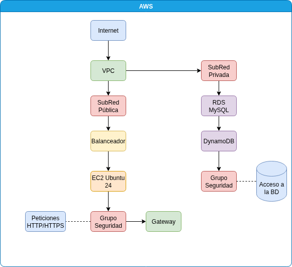

## 4. Herramientas y Recursos

- **IntelliJ IDEA**: Utilizado para editar scripts de configuración y código de aplicaciones.
- **SQLiteOnline**: Utilizado para prototipar y probar consultas SQL para la instancia RDS.
- **AWS capa gratuita**: Proporciona servicios como EC2, RDS, DynamoDB, VPC y otros servicios.

## 5. Pasos de Implementación

1. **Cómputo**: Desplegar una instancia EC2 con una aplicación Java y una función para un endpoint de API.
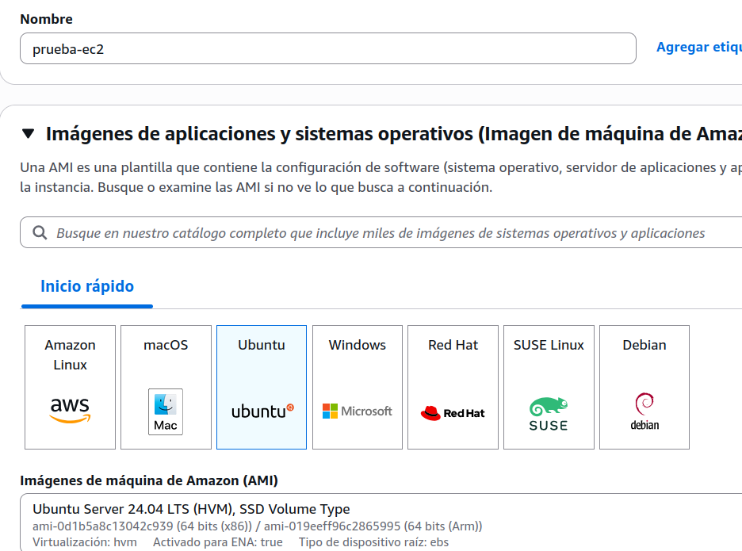
2. **Bases de Datos**: Configurar una instancia RDS MySQL con copias de seguridad automáticas y una tabla DynamoDB con índices secundarios. Probar consultas SQL en SQLiteOnline y consola.
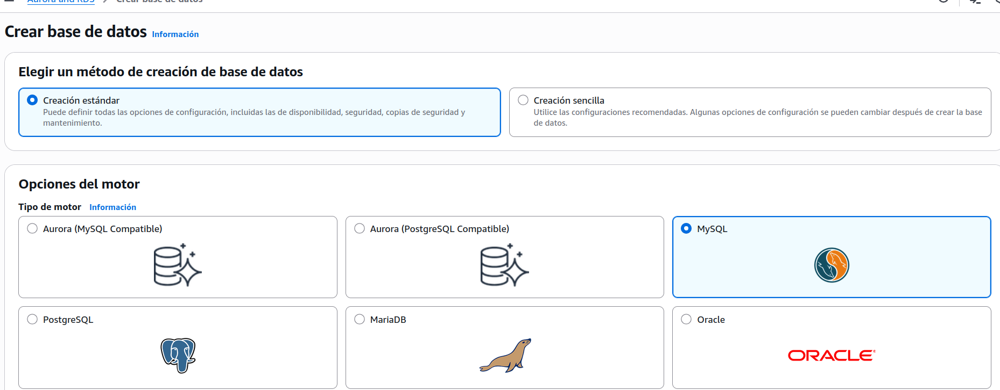

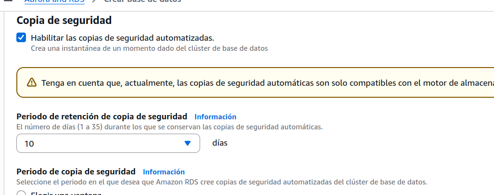

3. **Almacenamiento**: Crear buckets S3 para almacenamiento estándar y de archivo con políticas de ciclo de vida.
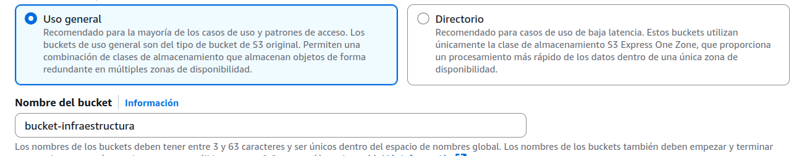

Configurar el bucket como un sitio web estatico, prueba del sitio en modo público, luego configurar cloudfront y bloquear el acceso publico al bucket

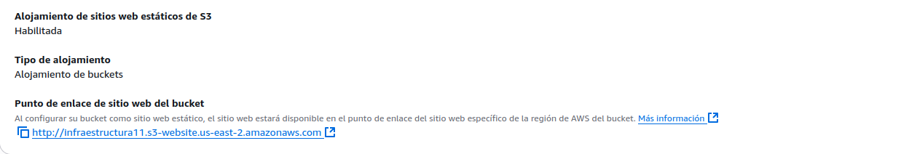

4. **Redes**: Configurar una VPC con subredes públicas/privadas, ELB y Grupos de Seguridad.
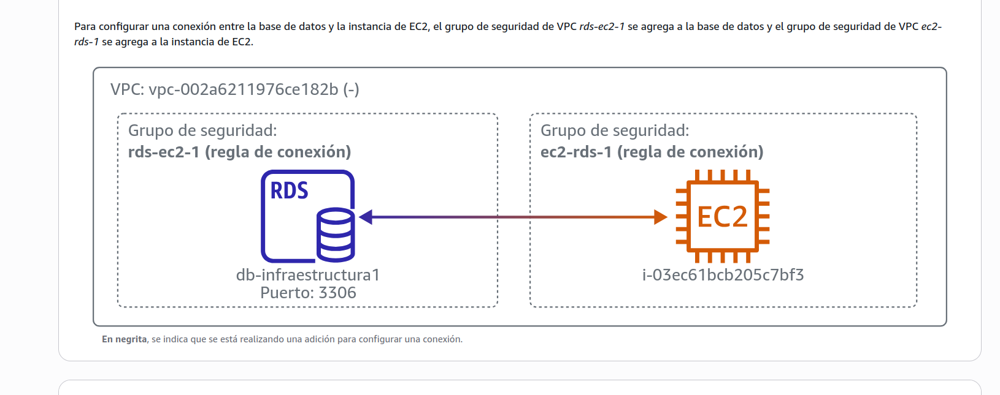
5. **Monitoreo/Notificaciones**: Configurar métricas de CloudWatch, alarmas, notificaciones SNS y una cola SQS desde la configuración de la instancia EC2.
6. **Alojamiento Estático**: Desplegar un sitio web estático en S3 con distribución CloudFront.

## 6. Conexión y pruebas
1. **SSH**: Conexión a la instancia via SSH desde terminal en sistema Ubuntu
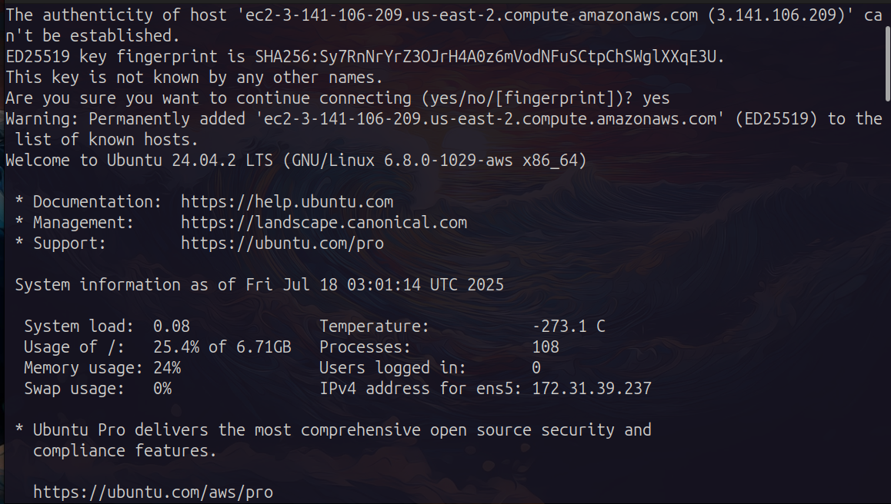

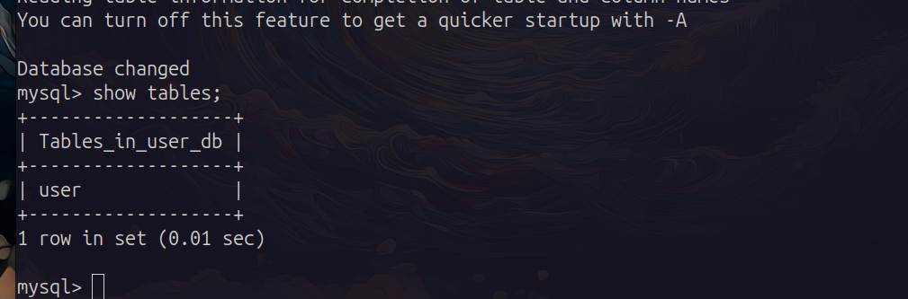

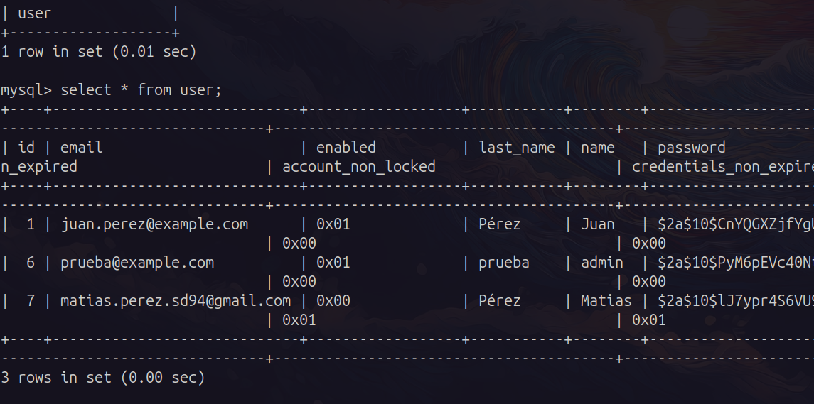

## 7. Justificación de Servicios

- **EC2**: Equilibra flexibilidad (EC2) y rentabilidad para necesidades de cómputo.
- **RDS/DynamoDB**: Soporta datos estructurados (RDS) y semiestructurados (DynamoDB), asegurando escalabilidad y rendimiento.
- **S3/Glacier**: Diferencia entre datos de acceso frecuente y de archivo para optimizar costos.
- **VPC/ELB**: Asegura redes seguras y escalables con entornos aislados.
- **CloudWatch/SNS/SQS**: Proporciona monitoreo proactivo y comunicación confiable.
- **S3/CloudFront**: Entrega contenido estático globalmente con alto rendimiento y seguridad.

Uso de S3 y CloudFront, configuración del bucket a privado.

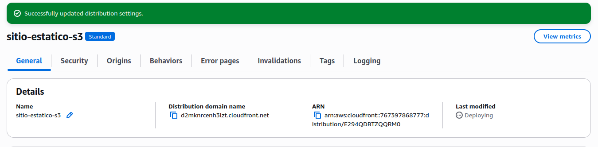
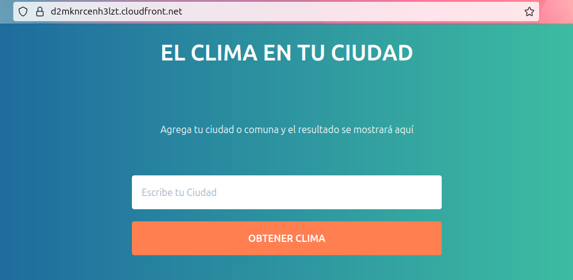
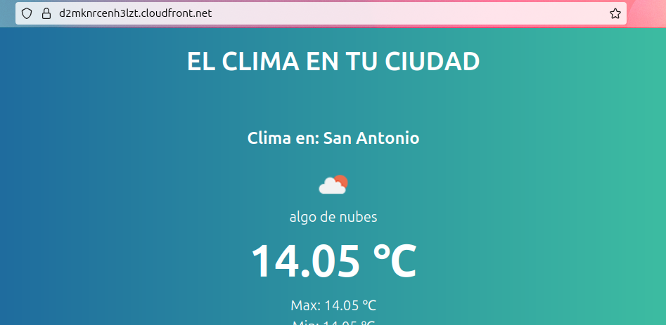
 

## 8. Conclusión

La arquitectura "Infraestructura Viva" aprovecha los recursos del nivel gratuito de AWS para una solución simple en la nube escalable, segura y rentable.
